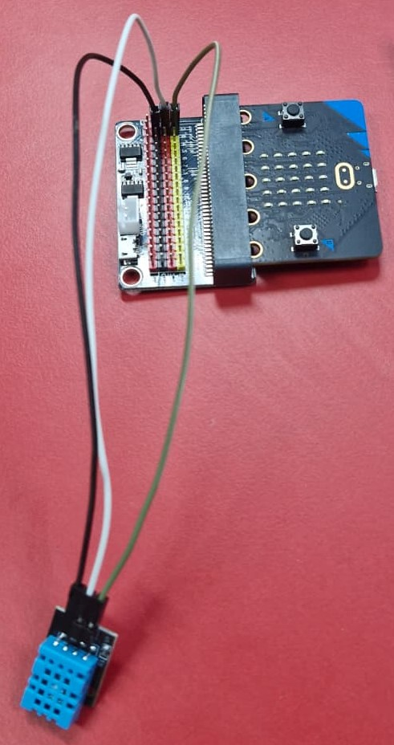
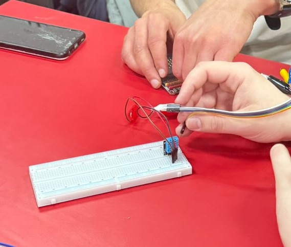
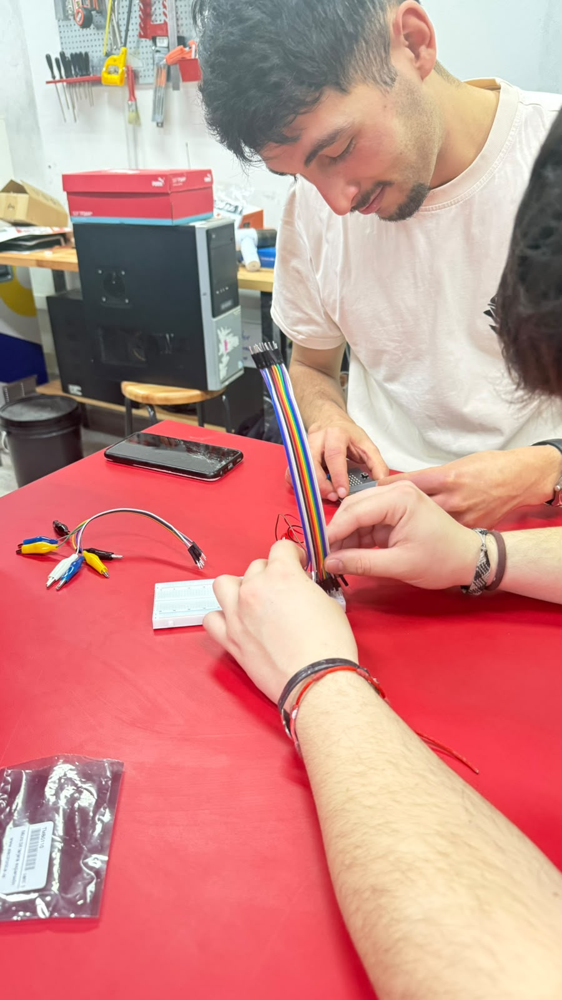
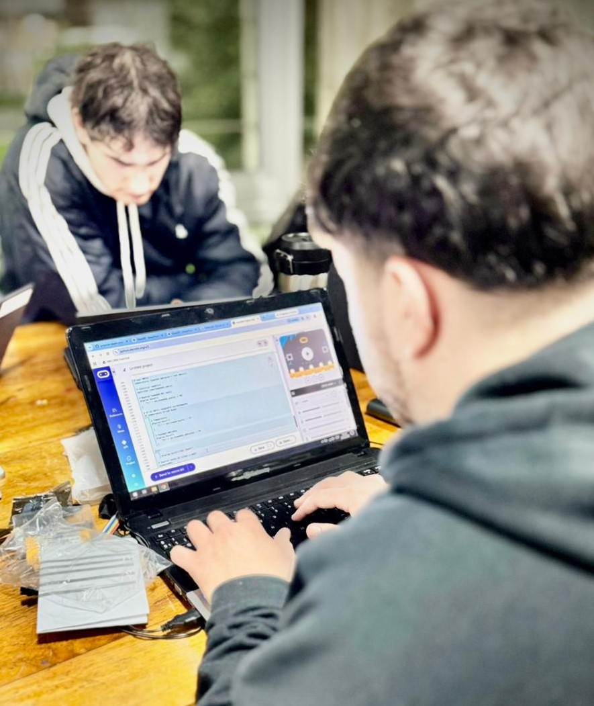
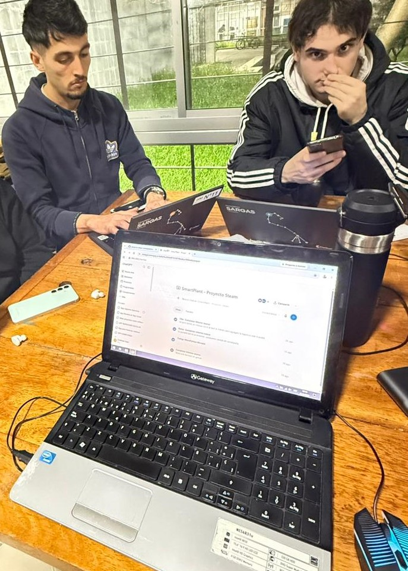

# Informe de Avance 1: Agosto 2026

## 5/8/2026

- Durante la clase se conformó el Grupo 2, integrado por Cristhian Sosa, Agustin Antelo, Emiliano Pérez y Gabriel Perlas. Se definió el proyecto **SmartPlant – Maceta Inteligente**, cuyo objetivo es desarrollar una maceta inteligente utilizando una BBC Micro:bit V2 para monitorear la humedad del suelo y alertar cuando la planta necesite agua. Como mejoras, se propuso incorporar la medición de temperatura y luz.

- **Tareas completadas:** Se definió el nombre, objetivo y funcionamiento general del proyecto. También se realizó la lista de materiales necesarios: BBC Micro:bit V2, cable USB, portapilas, 2 pilas AAA, protoboard, cables jumper, sensor de humedad de suelo, sensor DHT11, LDR, buzzer, LED verde, amarillo y rojo, resistencias de 220Ω, maceta, planta, tierra, base de madera o acrílico y caja para la electrónica. Además, se definió el repositorio de GitHub del proyecto.

- **Problemas encontrados y soluciones/alternativas propuestas:** En esta etapa no se presentaron problemas técnicos, ya que la clase estuvo enfocada principalmente en la planificación del proyecto. Se planteó verificar posteriormente la compatibilidad y conexión de los sensores con la Micro:bit.

- **Próximos pasos:** Investigar el funcionamiento de los sensores, definir las conexiones de los componentes con la Micro:bit y comenzar con las primeras pruebas del prototipo.

## 12/8/2026

- Durante la clase del 12 de agosto tuvimos nuestra **primera clase en el laboratorio** y el primer contacto práctico con los materiales disponibles para desarrollar SmartPlant. Realizamos un reconocimiento de los componentes y comenzamos a familiarizarnos con su funcionamiento, haciendo conexiones básicas entre la Micro:bit, el sensor DHT11 y la protoboard. Esta primera experiencia nos permitió comenzar a comprender cómo se conectarán los diferentes componentes del prototipo.

- **Tareas completadas:** Revisamos y organizamos los materiales disponibles: Micro:bit, protoboard, LED verde, amarillo y rojo, sensor DHT11, pilas AAA, portapilas AAA y cable Micro USB. También realizamos nuestras primeras conexiones de prueba con los componentes disponibles. Luego identificamos los materiales que todavía necesitábamos conseguir y buscamos opciones y precios en Mercado Libre.

- **Problemas encontrados y soluciones/alternativas propuestas:** Detectamos que todavía nos faltaban varios componentes necesarios para continuar con el proyecto: interruptor ON/OFF, cables jumper M/M y M/H, resistencias de 220 Ω, sensor de humedad del suelo, tarjeta de expansión y pantalla LED. Como alternativa, estuvimos buscando estos componentes en Mercado Libre y comparando precios para planificar su compra.

- **Próximos pasos:** Conseguir los componentes faltantes, continuar realizando pruebas de conexión con la Micro:bit y comenzar a probar individualmente el funcionamiento de los sensores, principalmente el DHT11 y, una vez adquirido, el sensor de humedad del suelo.
 

## 19/8/2026

* Durante la clase del 19 de agosto logramos definir de manera definitiva los **materiales necesarios para el desarrollo de SmartPlant** y avanzamos con la compra de los componentes que todavía faltaban. Además, comenzamos con la parte de programación del proyecto, escribiendo las primeras líneas de código en **Python** para la Micro:bit. Paralelamente, se realizaron las primeras actualizaciones del repositorio de GitHub y se comenzó a organizar la documentación correspondiente al proyecto, tarea que estuvo a cargo de **Agustin Antelo**.

- **Tareas completadas:** Se confirmó la lista definitiva de materiales y se avanzó con la compra de los componentes faltantes. Se escribieron las primeras líneas del código que utilizará la Micro:bit y se comenzó a establecer la lógica básica de funcionamiento del sistema. También se actualizaron los archivos y la documentación del repositorio de GitHub del proyecto.

- **Problemas encontrados y soluciones/alternativas propuestas:** Uno de los principales desafíos fue determinar cómo integrar los diferentes sensores y componentes mediante el código. Como solución, se decidió comenzar desarrollando y probando el programa de manera progresiva, incorporando cada componente por separado antes de realizar la integración completa.

- **Próximos pasos:** Reunir todos los materiales adquiridos, comenzar el armado de un primer prototipo funcional y realizar pruebas del código con los componentes reales para verificar las conexiones y el funcionamiento de los sensores.

## 26/8/2026

Durante la clase del 26 de agosto reunimos y organizamos los **materiales y componentes del proyecto SmartPlant** con el objetivo de comenzar la etapa de prototipado. A partir de los componentes disponibles comenzamos a preparar las conexiones necesarias para desarrollar los primeros prototipos funcionales del sistema. Al mismo tiempo, iniciamos las primeras pruebas del código desarrollado en Python con la Micro:bit para comprobar su funcionamiento con los componentes físicos.

- **Tareas completadas:** Se agruparon y organizaron los materiales del proyecto, se comenzó con el armado de los primeros prototipos y se implementaron las primeras pruebas del código Python en la Micro:bit. Esto permitió comenzar a relacionar la etapa de programación con el montaje físico del proyecto.

- **Problemas encontrados y soluciones/alternativas propuestas:** Durante esta etapa surgió la necesidad de verificar las conexiones y adaptar progresivamente el código a los componentes reales. Como alternativa, se decidió realizar pruebas individuales con los diferentes elementos antes de conectarlos todos simultáneamente, facilitando así la identificación de posibles errores.

- **Próximos pasos:** Continuar con las pruebas de los sensores y componentes, corregir posibles errores de conexión o programación, integrar progresivamente el sensor de humedad del suelo y el DHT11 con el sistema de alertas y avanzar hacia un prototipo funcional completo de SmartPlant.

- **Imágenes o videos ilustrativos del avance:** Agregar fotografías del armado del prototipo, de los componentes utilizados y capturas o videos de las primeras pruebas del código ejecutándose en la Micro:bit.

