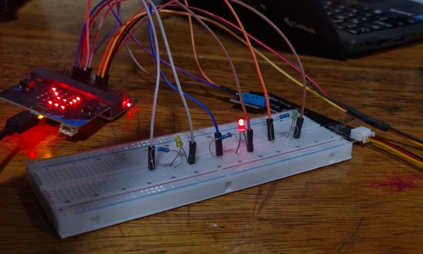
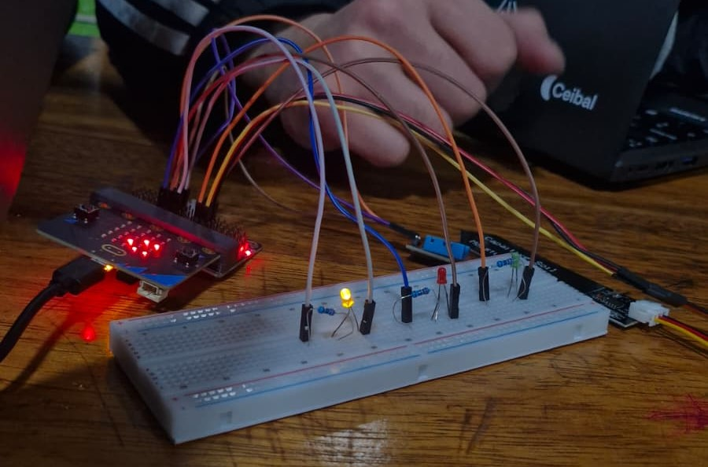

# Informe de Avance 2: Septiembre 202x

## 2/9/2026

* Durante la clase del 2 de septiembre realizamos los **primeros testeos del programa con los sensores del proyecto SmartPlant**. Probamos el funcionamiento del sensor DHT11 para obtener datos de temperatura y del sensor de humedad del suelo. Estas pruebas nos permitieron comprobar la comunicación entre los sensores y la Micro, además de comenzar a evaluar el funcionamiento del código desarrollado anteriormente.\

* **Tareas completadas:** Se realizaron las primeras pruebas del programa utilizando el sensor DHT11 y el sensor de humedad del suelo. También se revisaron las conexiones entre los sensores, la tarjeta de expansión y la Micro para comprobar que los datos pudieran ser obtenidos correctamente.

* **Problemas encontrados y soluciones/alternativas propuestas:** Durante los testeos surgieron algunos problemas relacionados con las conexiones y la correcta ubicación de los cables de alimentación y señal. Revisamos el circuito, identificamos las conexiones incorrectas y realizamos las correcciones necesarias, lo que nos permitió solucionar el problema y continuar con las pruebas.

* **Próximos pasos:** Continuar realizando pruebas con los sensores para comprobar la estabilidad y precisión de las mediciones. Además, se buscará incorporar una **pantalla LED** al prototipo para poder visualizar directamente los datos obtenidos por los sensores.

* **Imágenes o videos ilustrativos del avance:** 

## [x]/9/202x
- [Realizar una descripción de los avances en el proyecto en la fecha en uno o dos párrafos]
- [Incluir:]
  - [Tareas completadas]
  - [Problemas encontrados y soluciones/alternativas propuestas]
  - [Próximos pasos]
  - [Imágenes o videos ilustrativos del avance]

## [x]/9/202x
- [Realizar una descripción de los avances en el proyecto en la fecha en uno o dos párrafos]
- [Incluir:]
  - [Tareas completadas]
  - [Problemas encontrados y soluciones/alternativas propuestas]
  - [Próximos pasos]
  - [Imágenes o videos ilustrativos del avance]

## [x]/9/202x
- [Realizar una descripción de los avances en el proyecto en la fecha en uno o dos párrafos]
- [Incluir:]
  - [Tareas completadas]
  - [Problemas encontrados y soluciones/alternativas propuestas]
  - [Próximos pasos]
  - [Imágenes o videos ilustrativos del avance]

## Nota
En este enlace encontrarás un [ejemplo como debe completarse el informe de avance](avance_ejemplo.md).
