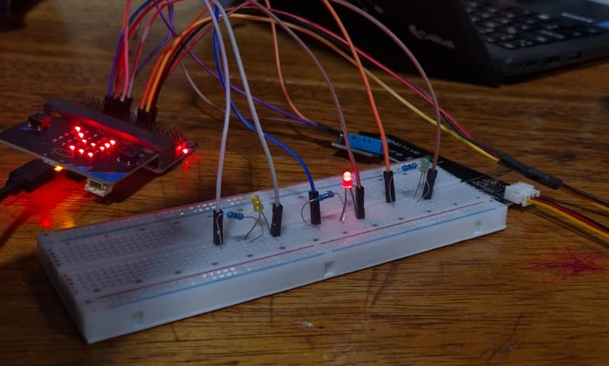
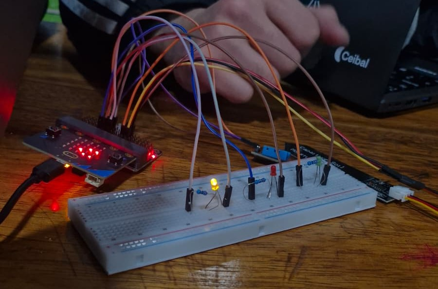

# Informe de Avance 2: Septiembre 202x

## 2/9/2026

* Durante la clase del 2 de septiembre realizamos los **primeros testeos del programa con los sensores del proyecto SmartPlant**. Probamos el funcionamiento del sensor DHT11 para obtener datos de temperatura y del sensor de humedad del suelo. Estas pruebas nos permitieron comprobar la comunicación entre los sensores y la Micro, además de comenzar a evaluar el funcionamiento del código desarrollado anteriormente.\

* **Tareas completadas:** Se realizaron las primeras pruebas del programa utilizando el sensor DHT11 y el sensor de humedad del suelo. También se revisaron las conexiones entre los sensores, la tarjeta de expansión y la Micro para comprobar que los datos pudieran ser obtenidos correctamente.

* **Problemas encontrados y soluciones/alternativas propuestas:** Durante los testeos surgieron algunos problemas relacionados con las conexiones y la correcta ubicación de los cables de alimentación y señal. Revisamos el circuito, identificamos las conexiones incorrectas y realizamos las correcciones necesarias, lo que nos permitió solucionar el problema y continuar con las pruebas.

* **Próximos pasos:** Continuar realizando pruebas con los sensores para comprobar la estabilidad y precisión de las mediciones. Además, se buscará incorporar una **pantalla LED** al prototipo para poder visualizar directamente los datos obtenidos por los sensores.

* **Imágenes o videos ilustrativos del avance:** 

## 16/9/2026
- [Realizar una descripción de los avances en el proyecto en la fecha en uno o dos párrafos]
- [Incluir:]

### Tareas completadas

### Problemas encontrados y soluciones/alternativas propuestas
  - Tenemos que subir el codigo al git, asi no se vuelve indispensable algun compañero.
  - Queremos reorganizar

### Próximos pasos
Falta completar

### Imágenes o videos ilustrativos del avance
Falta completar

## [x]/9/202x
- [Realizar una descripción de los avances en el proyecto en la fecha en uno o dos párrafos]
- [Incluir:]
  - [Tareas completadas]
  - [Problemas encontrados y soluciones/alternativas propuestas]
  - [Próximos pasos]
  - [Imágenes o videos ilustrativos del avance]

## 30/9/2026
- [Realizar una descripción de los avances en el proyecto en la fecha en uno o dos párrafos]
- El día de la fecha retomamos desde las vacaciones. Comprobamos el código hasta donde lo dejamos en la anterior instancia.
- Comprobamos del sensor de humedad en funcionamiento con luces led.
- Trabajamos en darle uso al sensor DHT11, leyendo temperatura, imprimiendo en pantalla oled e imprimiendo en el semaforo de luces led.
- Trabajamos en solucionar los errores de dicho al leer el sensor. El profesor nos presto su sensor DHT11 para corroborar si era que el sensor fallaba en sí. Descartamos que el sensor sea el problema.
- Procedimos haciendo prueba con distintos códigos. Luego buscamos simplificar las conexiones, para mayor entendimiento nuestro. Dimos coneccion al DHT11 en otra parte de la placa expansora de Micro BIT.
- Logramos la lectura por consola, pero dado que es un sensor compuesto (temperatura y humedad) el valor medido no sabemos de que lectura es. La funcion "leer_dht11" se inicia pero no levanta los valores ("none, none").

## Nota
En este enlace encontrarás un [ejemplo como debe completarse el informe de avance](avance_ejemplo.md).
